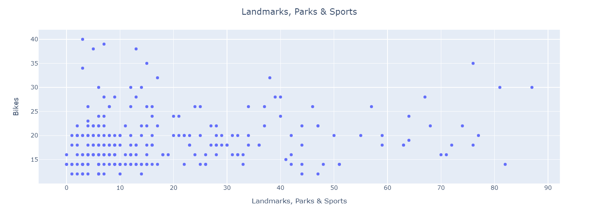
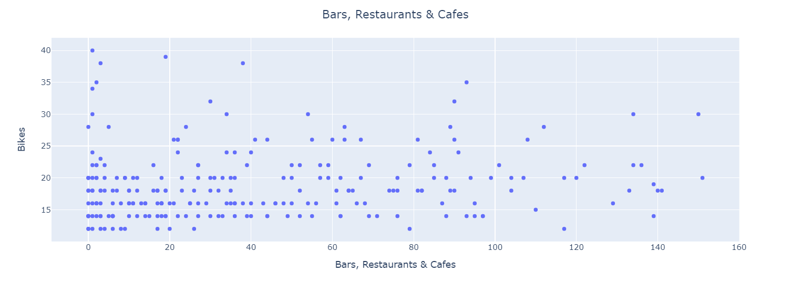
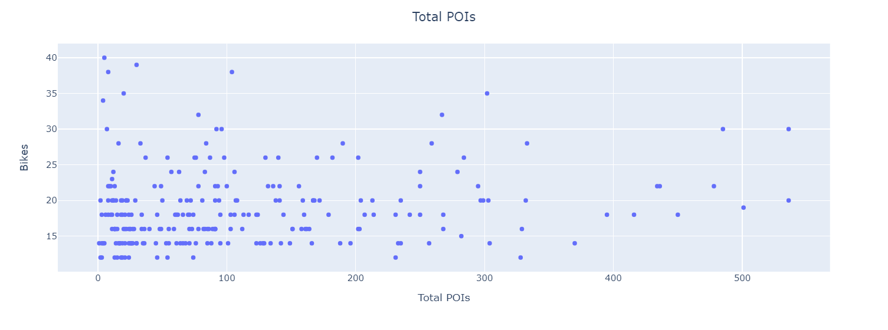

# Final-Project-Statistical-Modelling-with-Python

## Project/Goals
In this project, I examine the locations and capacities of the Mobi bikeshare system in Vancouver, BC. I compare this data to data from Yelp and Foursquare, looking for points of interest (POIs) around each bike station. My goal is to determine if there is a relation between the number and types of POIs around each station and the bike capacity of that station. I attempt to build a statistical model of the relationship.

## Process
I begin with pulling data about each bike station from the City Bike API. Specifically, I take the station location, name and total number of bike slots.

Next, I looked at the categories from the Yelp and Foursquare APIs and decided which types of POIs I thouhgt were most likely to have an impact on bike traffic. I chose the following categories:
* Bars, Restaurants and Cafes
* Arts & Entertainment
* Landmarks, Outdoors & Sports
* Retail (specifically grocery, beer/liquor, drug, convenience, clothing, electronics, book, and department stores)
* Municipal Buildings/Services (hospitals, libraries, community centers and SkyTrain stations)
* Schools (high schools, colleges and universities)

I retrieved these POIs from both Foursquare and Yelp within a 300 m radius of each bike station. After retrieving them, I sorted through the data to delete duplicates, including for example places listed as both bars and restaurants, or stores listed as both department and clothing stores.

For each bike station, I found the total for each category and the total across all categories. I then generated some graphs to visualize this data and created a couple statistical models, one based on the data and one based on a transformation to normalize the data.

Data sources: [CityBikes](https://citybik.es/), [FourSquare](https://location.foursquare.com/developer/reference/places-api-overview), [Yelp](https://fusion.yelp.com/)

## Results
Based on the categories and POIs used in this dataset, there was no strong relationship found between the types or number of POIs and the number of bike slots. My first model had an Adjusted R-Squared value of 0.025 and the only statistically significant variable from this model was the 'Landmarks, Parks & Sports' category of POIs.

After transforming the data, the model had a slightly higher Adjusted R-Squared value at 0.082 and a couple other categories seemed statistically significant in addition to 'Landmarks, Parks & Sports.' 'Schools' and 'Total POIs' both had an impact in the second model. That being said, neither model has a very high Adjusted R-Squared value, so neither should be looked at as very predictive of the number of bike slots.

Below is a sample of some of the scatter plots showing different categories of POIs vs the number of bike slots at stations:

## Challenges 
One challenge I encountered was the result limit and request limits for Foursquare and Yelp API requests. My models may be improved by including more categories of POIs and breaking the categories I used down into more granularity. For example, 'Landmarks, Parks & Sports' includes bike paths, which may be more important than other things in that category like yoga studios. Because of request limits, I also opted to exclude locations like office buildings that might attract commuter traffic, and I only took a selection of types of retail and municipal buildings.

Another large issue with the data is the overlap between Foursquare and Yelp data. Many POIs appeared in both sets of data, but with typos or slightly different business names and slightly different location coordinates. Some examples:
* West Coast Liquor Company vs West Coast Liquor Co
* Harry Jerome Monument vs Harry Jerome Statue
* Kerrisdale Park vs Kerridale Park
* Teahouse in Stanley Park vs The Teahouse Restaurant

I was not able to tell exactly how many POIs this affected, and it certainly distorted the data put into the statistical model. I had also hoped to use average ratings and number of reviews as part of my modeling, but without the ability to match Foursquare and Yelp data better, these features were not usable.

## Future Goals
To take this project further, the data would need to be cleaned more to eliminate near matches, and categories should be broken down to give further detail. Other factors that could be considered include a bike station's proximity to other bike stations and population density around each station.
